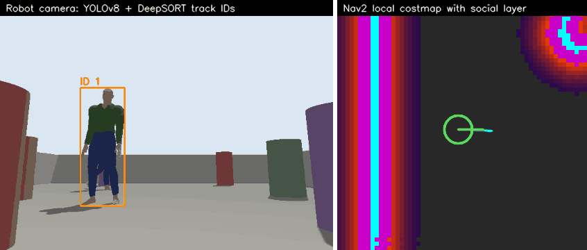
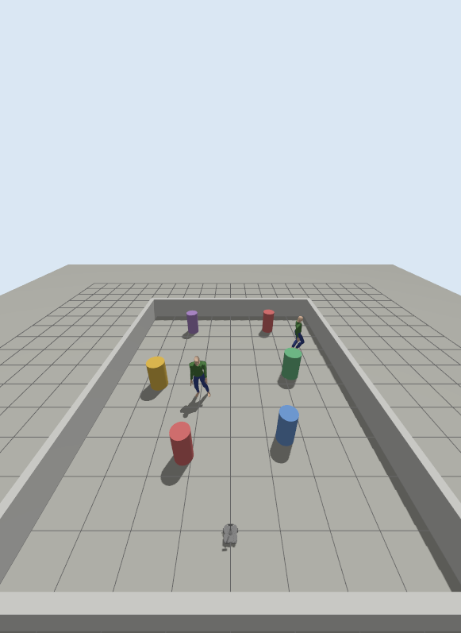
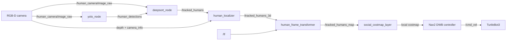
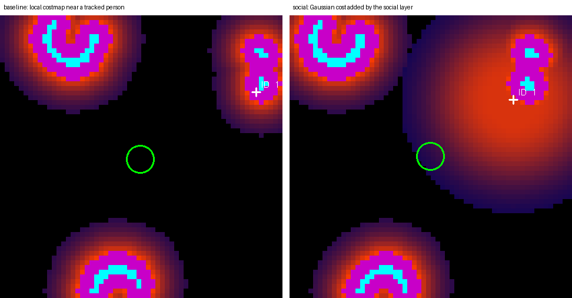
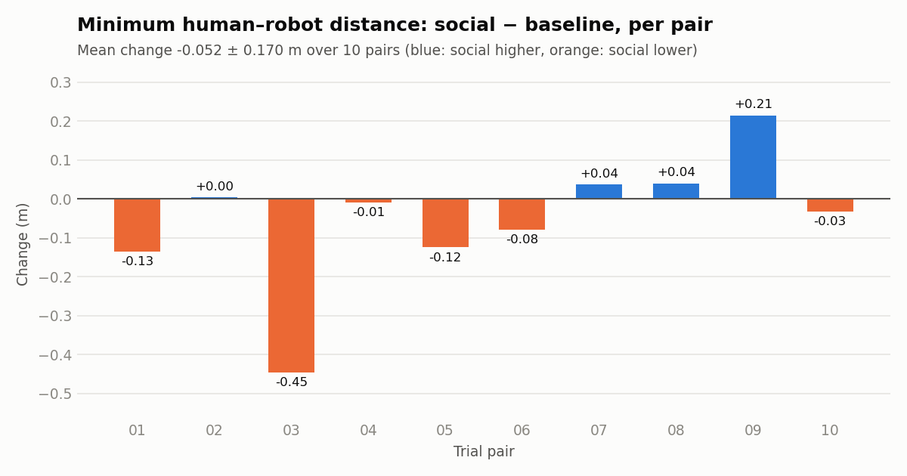
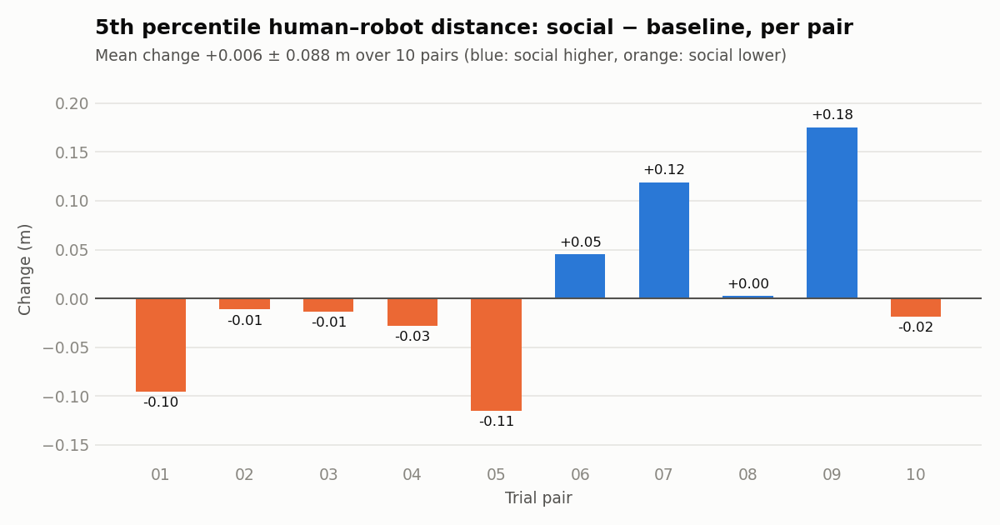
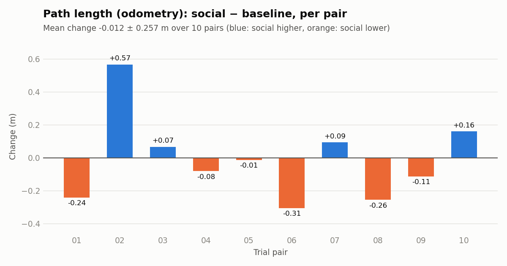

# Human-Aware Robot Navigation

Vision-based human detection and tracking (YOLOv8 + DeepSORT) feeding a social costmap layer in ROS 2 Nav2.



*Left: the robot's camera with DeepSORT track IDs. Right: the Nav2 local costmap, drawn from the recorded `/local_costmap/costmap` topic (robot in green, tracked people as white crosses). The wide red disc is the cost added by the social layer; it disappears when the person leaves the camera's field of view.*

## What it does and why

A detector on its own does not change how a robot behaves. This project closes the loop from pixels to motion:

1. A TurtleBot3 Waffle in Gazebo carries an RGB-D camera.
2. YOLOv8n detects people in the RGB image.
3. DeepSORT gives each person a track ID.
4. The depth image and camera intrinsics turn each track into a 3D point, which TF moves into the `map` frame.
5. A custom Nav2 costmap layer (C++) adds a Gaussian-like cost around each tracked person.
6. Baseline runs (plain Nav2) and social runs (Nav2 + the layer) are recorded with rosbag2 and compared offline on human–robot clearance.

Everything runs on CPU.



## Architecture



| Package | Language | Responsibility |
|---|---|---|
| `human_interfaces` | msg | `TrackedHuman`, `TrackedHumanArray` |
| `human_detection` | Python | `yolo_node`: RGB → person detections |
| `human_tracking` | Python | `deepsort_node`, `human_localizer`, `human_frame_transformer` |
| `social_costmap_layer` | C++ | Nav2 costmap plugin |
| `human_bringup` | Python (launch) | world, robot, map, parameters, launch files |
| `human_evaluation` | Python | live check, experiment goal runner, offline bag analysis |

More detail, including the step-by-step path from a pixel to a costmap cell, is in [docs/architecture.md](docs/architecture.md).

## Quick start

ROS 2 Jazzy targets Ubuntu 24.04, so everything runs in a container. You need `podman` or `docker` and an X11 or Wayland desktop. Developed on Fedora with podman.

```bash
git clone https://github.com/avcibatuhan/human-aware-robot-navigation.git
cd human-aware-robot-navigation

# Builds the image on first use (several GB), then builds the workspace.
docker/run.sh 'cd /ws/ros2_ws && colcon build --symlink-install'
```

Then, in three terminals (the first starts the container, the others attach to it):

```bash
# 1. Gazebo world, robot, RViz
docker/run.sh 'ros2 launch human_bringup sim.launch.py fixed_frame:=map'

# 2. Nav2 with the social layer, plus the perception pipeline
docker/run.sh 'ros2 launch human_bringup navigation.launch.py mode:=social debug_image:=true'

# 3. Send the robot across the arena
docker/run.sh 'ros2 run human_evaluation run_goal --x 4.0 --y 0.0'
```

Use `mode:=baseline` for plain Nav2. A goal can also be set in RViz with "2D Goal Pose". The human models and the YOLOv8n weights are downloaded on first launch and cached in podman/docker volumes.

Check the perception topics while it runs:

```bash
docker/run.sh 'ros2 run human_evaluation live_summary --ros-args -p duration:=15.0'
```

Run the tests:

```bash
docker/run.sh 'cd /ws/ros2_ws && colcon test && colcon test-result --verbose'
```

### Python packages outside ROS

`ultralytics` and `deep-sort-realtime` are not ROS packages. The [Dockerfile](docker/Dockerfile) installs [requirements.txt](requirements.txt) into a virtual environment created with `--system-site-packages`, so `rclpy` and `cv_bridge` stay visible, and adds that environment to `PYTHONPATH`, because ROS entry points start with the system interpreter. `numpy` is held below 2 for `cv_bridge`, and PyTorch comes from the CPU-only index.

## Configuration

Parameters live in [perception.yaml](ros2_ws/src/human_bringup/config/perception.yaml), [nav2_baseline.yaml](ros2_ws/src/human_bringup/config/nav2_baseline.yaml) and [nav2_social.yaml](ros2_ws/src/human_bringup/config/nav2_social.yaml). The two Nav2 files differ only by the social layer; a unit test enforces that.

| Component | Parameter | Value |
|---|---|---|
| YOLO | weights | `yolov8n.pt` |
| YOLO | confidence threshold | `0.5` |
| YOLO | classes | person only |
| DeepSORT | `max_age` | `30` |
| DeepSORT | `n_init` | `3` |
| DeepSORT | `embedder_gpu` | `False` |
| Localizer | depth window | median over 11 × 11 px at the box centre |
| Localizer | depth band-pass | `0.5`–`10` m |
| Transformer | `max_position_jump` | `0.5` m |
| Social layer | `humans_topic` | `/tracked_humans_map` |
| Social layer | `social_radius` | `1.2` m |
| Social layer | `lethal_radius` | `0.25` m |
| Social layer | `sigma` | `0.45` |
| Social layer | `max_human_age` | `2.0` s |
| Social layer | `peak_cost` | `220` |
| Nav2 controller (DWB) | `max_vel_x` | `0.3` m/s |
| Nav2 controller (DWB) | `max_vel_theta` | `1.0` rad/s |
| Nav2 controller | `controller_frequency` | `10.0` Hz |

Social cost for a cell at distance `d` from a person: `peak_cost` up to `lethal_radius`, then `peak_cost · exp(−(d − lethal_radius)² / (2·sigma²))` up to `social_radius`, nothing beyond. The layer takes the maximum with the existing cost.



## Evaluation

### Method

Each trial starts a fresh simulation, so the robot and both people begin at the same poses. The robot drives from (−4, 0) to (4, 0), past a standing person and across the path of a walking person. The goal is sent at a simulation time derived from the trial number, so the baseline and social run of a pair meet the walking person at the same point of its loop, and different pairs at different points.

```bash
# 10 baseline/social pairs, about 50 minutes
docker/run.sh 'cd /ws && scripts/run_all_experiments.sh 10'

docker/run.sh 'cd /ws && ros2 run human_evaluation compare_navigation bags'
docker/run.sh 'cd /ws && ros2 run human_evaluation export_navigation_results bags results'
```

Metrics are computed offline from the bags, between the moment the goal is sent and the moment Nav2 reports the result:

| Metric | Source |
|---|---|
| Minimum, 5th percentile and average human–robot distance (x-y plane) | `/tracked_humans_map`, `/tf`, `/odom` |
| Path length | `/odom` |
| Average commanded linear velocity | `/cmd_vel` |
| Human sample count | `/tracked_humans_map` |
| Message count and approximate frequency per topic | bag metadata |

The robot pose at each human sample is interpolated in time. A bag is **valid** only if it contains the camera topics, `/human_detections`, `/tracked_humans`, `/tracked_humans_3d`, `/tracked_humans_map`, `/tf`, `/odom`, `/cmd_vel`, `/plan` and `/local_plan`. A pair is used only if both runs are valid and reached the goal; everything else is listed in [results/excluded.csv](results/excluded.csv).

### Results

Ten baseline/social pairs were recorded. All 20 bags are valid, all 20 runs reached the goal, and no bag was excluded.

**The social layer did not increase human–robot clearance in this setup.** The mean change in minimum distance is -0.052 ± 0.170 m, with the social run closer than the baseline run in 6 of 10 pairs. None of the differences below is distinguishable from run-to-run variation.

| Metric | Baseline (mean ± std) | Social (mean ± std) | Change, social − baseline (mean ± std) | Pairs where social is higher |
|---|---|---|---|---|
| Minimum human–robot distance (m) | 1.351 ± 0.133 | 1.298 ± 0.178 | -0.052 ± 0.170 | 4 / 10 |
| 5th percentile human–robot distance (m) | 1.547 ± 0.135 | 1.553 ± 0.074 | +0.006 ± 0.088 | 4 / 10 |
| Average human–robot distance (m) | 3.335 ± 0.202 | 3.333 ± 0.197 | -0.001 ± 0.122 | 5 / 10 |
| Path length (odometry) (m) | 8.328 ± 0.270 | 8.315 ± 0.348 | -0.012 ± 0.257 | 4 / 10 |
| Average commanded linear velocity (m/s) | 0.247 ± 0.016 | 0.251 ± 0.016 | +0.005 ± 0.022 | 8 / 10 |
| Time to goal (s) | 33.3 ± 2.7 | 32.7 ± 3.3 | -0.7 ± 4.0 | 2 / 10 |

Standard deviations are sample standard deviations over the 10 pairs.

| Pair | Min distance, baseline (m) | Min distance, social (m) | Δ min (m) | Δ p5 (m) | Δ mean (m) | Δ path (m) | Δ time (s) |
|---|---|---|---|---|---|---|---|
| 01 | 1.581 | 1.447 | -0.134 | -0.096 | -0.113 | -0.242 | -4.5 |
| 02 | 1.213 | 1.218 | +0.005 | -0.011 | -0.108 | +0.567 | +9.6 |
| 03 | 1.305 | 0.859 | -0.445 | -0.014 | +0.159 | +0.067 | -3.1 |
| 04 | 1.259 | 1.251 | -0.009 | -0.028 | +0.060 | -0.081 | -4.0 |
| 05 | 1.565 | 1.441 | -0.124 | -0.115 | -0.127 | -0.014 | -0.1 |
| 06 | 1.348 | 1.270 | -0.079 | +0.045 | +0.045 | -0.305 | +0.2 |
| 07 | 1.325 | 1.363 | +0.038 | +0.119 | -0.029 | +0.094 | -0.1 |
| 08 | 1.237 | 1.277 | +0.040 | +0.003 | -0.152 | -0.256 | -2.9 |
| 09 | 1.243 | 1.458 | +0.215 | +0.175 | +0.187 | -0.114 | -1.4 |
| 10 | 1.429 | 1.397 | -0.031 | -0.019 | +0.067 | +0.160 | -0.2 |





Raw numbers: [per_bag.csv](results/per_bag.csv), [per_pair.csv](results/per_pair.csv), [summary.csv](results/summary.csv), [topic_rates.csv](results/topic_rates.csv). The bags themselves are not committed.

Why there is no effect is not established by these runs. The demo above shows one candidate: the person leaves the camera's field of view shortly before the robot passes, and the social cost expires two seconds later. The first two items of the roadmap (ground-truth clearance and latency) are the measurements needed to check it.

## Limitations

- **Simulation only.** Nothing here has run on a real robot.
- **No ground-truth tracking metrics.** There is no MOTA, IDF1 or localization error; the actor poses from Gazebo are not recorded yet.
- **Distances come from the perception output itself.** Human–robot distance uses the tracked positions, so a tracking error is also a measurement error, and a person who is not tracked is not measured.
- **The camera only looks forward.** With a 69° field of view the person leaves the image shortly before the robot passes them. The social cost then expires after `max_human_age` (2 s), close to the moment of closest approach.
- **Track IDs are not stable.** Both simulated people use the same model, so appearance cannot tell them apart, and the walking person is often re-acquired under a new ID.
- **Position bias.** Depth is sampled on the body surface, and boxes are cropped when the robot is close, which shifts the estimated position by up to a few tens of centimetres.
- **Circular cost.** The social cost is isotropic and ignores the person's heading and velocity.
- **Local costmap only.** The layer sits in the 3 m × 3 m local costmap; the global planner does not see it, and DWB treats social cost like any other cost.
- **One CPU for everything.** Detection, tracking, simulation and Nav2 share the machine; torch threads are capped so they do not starve each other.

## Roadmap

- Ground-truth evaluation: record actor poses from Gazebo; compute MOTA, IDF1, ID switches and localization error; compute clearance against ground truth.
- Latency: measure the delay from camera timestamp to `/tracked_humans_map` to costmap update.
- Perception rate: frame skipping, lower input resolution, ONNX export.
- Tracker comparison: ByteTrack or OC-SORT behind the same node interface.
- Elliptical, velocity-oriented social cost in the direction of motion.
- Extra metrics: jerk, goal success rate, timeouts, recovery count.

## License

[AGPL-3.0](LICENSE). Ultralytics YOLOv8 is AGPL-3.0. The robot model and Nav2 parameters are based on ROBOTIS TurtleBot3 files (Apache-2.0).

---

Rebuild of my MSc dissertation in Artificial Intelligence (BSBI / University for the Creative Arts, 2026).
