# Architecture

## Topic graph

```mermaid
flowchart LR
    subgraph sim["Gazebo Harmonic"]
        cam["RGB-D camera<br/>on TurtleBot3 Waffle"]
        lidar["Lidar"]
        base["Diff drive"]
    end

    subgraph perception["Perception (Python)"]
        yolo["yolo_node<br/>YOLOv8n, person only"]
        deepsort["deepsort_node<br/>DeepSORT"]
        localizer["human_localizer<br/>depth median + pinhole projection"]
        transformer["human_frame_transformer<br/>TF to map, jump filter, velocity"]
    end

    subgraph nav["Nav2"]
        amcl["AMCL + map server"]
        social["social_costmap_layer<br/>(C++ plugin, local costmap)"]
        controller["DWB controller"]
    end

    cam -- "/human_camera/image_raw" --> yolo
    cam -- "/human_camera/image_raw" --> deepsort
    yolo -- "/human_detections" --> deepsort
    deepsort -- "/tracked_humans" --> localizer
    cam -- "/human_camera/depth/image_raw<br/>/human_camera/camera_info" --> localizer
    localizer -- "/tracked_humans_3d" --> transformer
    amcl -- "/tf (map → odom)" --> transformer
    transformer -- "/tracked_humans_map" --> social
    lidar -- "/scan" --> amcl
    lidar -- "/scan" --> social
    social -- "local costmap" --> controller
    controller -- "/cmd_vel" --> base
    base -- "/odom, /tf" --> amcl
```

## Nodes and topics

| Node | Subscribes | Publishes |
|---|---|---|
| `yolo_node` | `/human_camera/image_raw` | `/human_detections` (`TrackedHumanArray`, `id = -1`) |
| `deepsort_node` | `/human_detections`, `/human_camera/image_raw` | `/tracked_humans` |
| `human_localizer` | `/tracked_humans`, `/human_camera/depth/image_raw`, `/human_camera/camera_info` | `/tracked_humans_3d` (camera optical frame) |
| `human_frame_transformer` | `/tracked_humans_3d`, `/tf` | `/tracked_humans_map` (`frame_id: map`), `/tracked_humans_markers` |
| `social_costmap_layer` | `/tracked_humans_map` | cost in the Nav2 local costmap |

## Packages

| Package | Language | Responsibility |
|---|---|---|
| `human_interfaces` | msg | `TrackedHuman`, `TrackedHumanArray` |
| `human_detection` | Python | `yolo_node` |
| `human_tracking` | Python | `deepsort_node`, `human_localizer`, `human_frame_transformer` |
| `social_costmap_layer` | C++ | Nav2 costmap plugin |
| `human_bringup` | Python (launch) | world, robot model, map, parameters, launch files |
| `human_evaluation` | Python | `live_summary`, `run_goal`, `bag_summary`, `compare_navigation`, `export_navigation_results` |

The projection, depth filtering, jump rejection, velocity estimation, metric
calculations and the social cost function are plain modules without ROS
imports, each with unit tests; the ROS nodes are thin wrappers around them.

## From pixel to costmap

1. **Detection.** YOLOv8n finds people in the RGB image (confidence ≥ 0.5).
2. **Tracking.** DeepSORT assigns an ID to each detection; only confirmed
   tracks matched in the current frame are published.
3. **Depth.** The depth is the median of the valid pixels in an 11 × 11 window
   at the box centre; values outside 0.5–10 m and NaN/inf are rejected.
4. **Projection.** `X = (u − cx)·Z / fx`, `Y = (v − cy)·Z / fy`, with the
   intrinsics from `/human_camera/camera_info`.
5. **Map frame.** The point is transformed to `map` with TF at the image
   timestamp. A new position more than 0.5 m from the track's last accepted
   one is discarded. Velocity is the smoothed finite difference of accepted
   positions.
6. **Cost.** For a cell at distance `d` from a person:
   `d ≤ 0.25 m` → 220; up to `1.2 m` → `220 · exp(−(d − 0.25)² / (2 · 0.45²))`;
   beyond that nothing. The layer takes the maximum with the existing cost and
   ignores humans older than 2 s.
